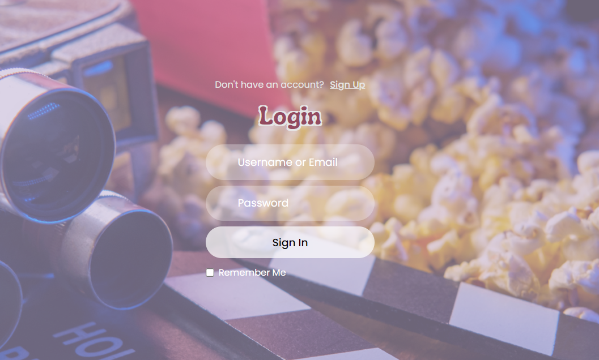
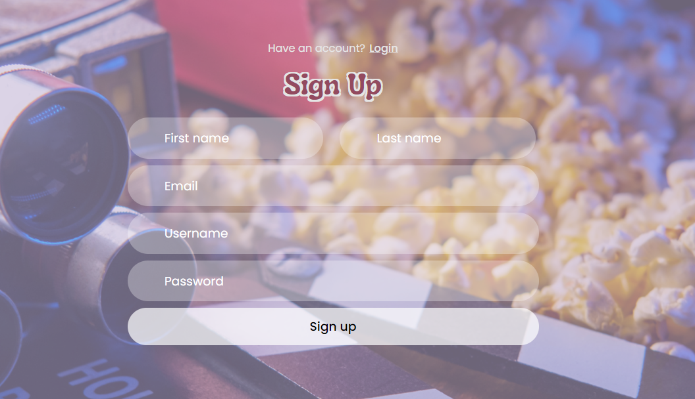
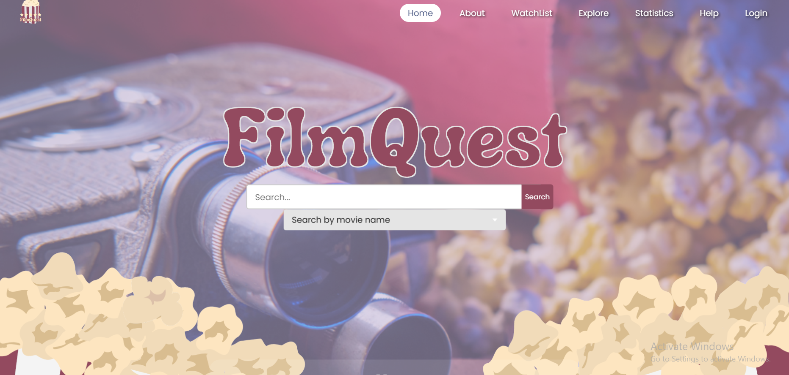
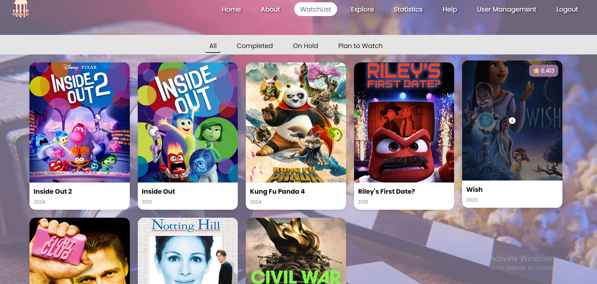
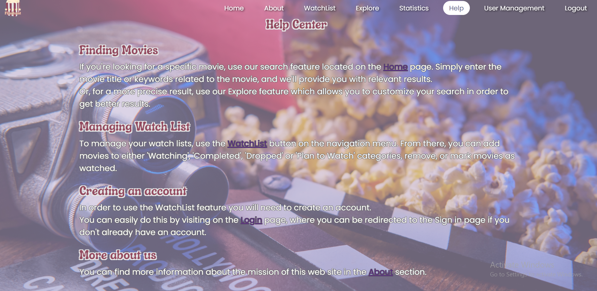
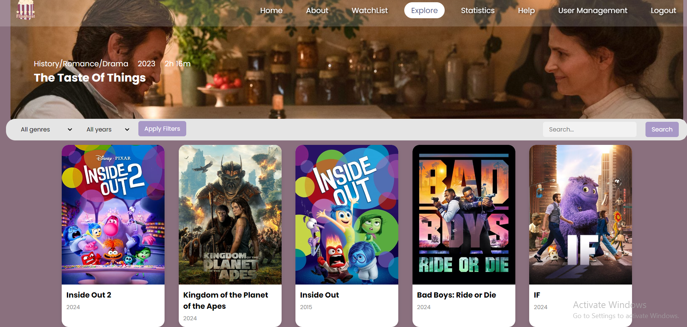
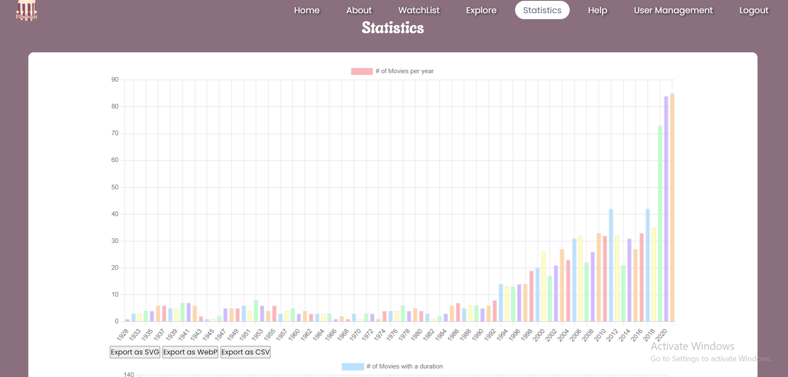
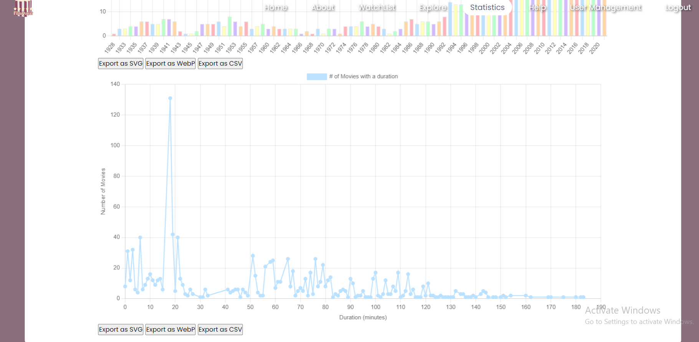
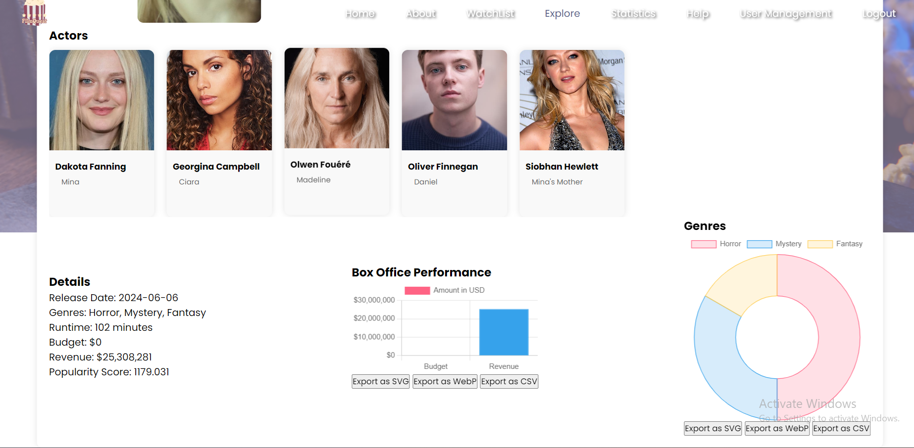
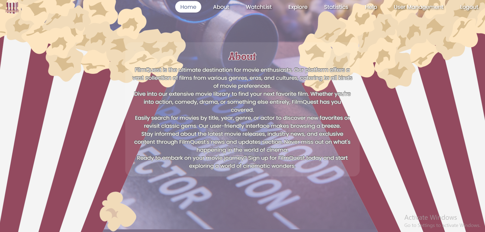

<!DOCTYPE html>
<html lang="ro">
<head>
    <meta charset="UTF-8">
    <title>MoX (Movies and TV Shows Explorer) / FilmQuest</title>
</head>
<body>
<article>
    <header>
        <h1>
            MoX (Movies and TV Shows Explorer) / FilmQuest
        </h1>
    </header>
    <h2>Cuprins</h2>
    <ul>
        <li>
            <a href="#authors">Autori</a>
        </li>
        <li>
            <a href="#introduction">1. Introducere</a>
            <ul>
                <li><a href="#introduction-purpose">1.1 Scop</a></li>
                <li><a href="#conventions">1.2 Convenție de scriere</a></li>
                <li><a href="#audience">1.3 Publicul țintă</a></li>
                <li><a href="#product-scope">1.4 Scopul produsului</a></li>
                <li><a href="#references">1.5 Referințe</a></li>
            </ul>
        </li>
        <li><a href="#overall">2. Descriere Generală</a>
            <ul>
                <li><a href="#product-perspective">2.1 Perspectiva produsului</a></li>
                <li><a href="#product-functions">2.2 Funcțiile produsului</a></li>
                <li><a href="#users">2.3 Clase și caracteristici ale utilizatorilor</a></li>
                <li><a href="#operating-environment">2.4 Mediul de operare</a></li>
                <li><a href="#documentation">2.5 Documentația pentru utilizator</a></li>
            </ul>
        </li>
        <li><a href="#external">3. Interfețele aplicației </a>
            <ul>
                <li><a href="#user-interface">3.1 Interfața utilizatorului </a>
                    <ul>
                        <li><a href="#nav-bar">3.1.1 Bara de navigație </a></li>
                        <li><a href="#login-page">3.1.2 Pagina de autentificare </a></li>
                        <li><a href="#signup-page">3.1.3 Pagina de înregistrare </a></li>
                        <li><a href="#home-page">3.1.6 Pagina de acasă </a></li>
                        <li><a href="#watchlist">3.1.7 Pagina WatchList</a></li>
                        <li><a href="#help">3.1.8 Pagina de ajutor</a></li>
                        <li><a href="#explore">3.1.9 Pagina Explore</a></li>
                        <li><a href="#statistics">3.1.10 Pagina de Statistici</a></li>
                        <li><a href="#about">3.1.11 Pagina informativă </a></li>
                        <li><a href="#user-management">3.1.12 Pagina administratorului</a></li>
                    </ul>
                </li>
                <li><a href="#hardware-interface">3.2 Interfața Hardware </a></li>
                <li><a href="#software-interface">3.3 Interfața Software</a></li>
                <li><a href="#communication-interface">3.4 Interfața de comunicare</a></li>
            </ul>
        </li>
        <li><a href="#system-features">4. Caracteristici ale sistemului</a>
            <ul>
                <li><a href="#management">4.1 Gestionarea contului </a>
                    <ul>
                        <li><a href="#management-1">4.1.1 Descriere și generalități </a></li>
                        <li><a href="#management-2">4.1.2 Actualizarea informațiilor</a></li>
                        <li><a href="#management-3">4.1.3 Condiții de funcționare</a></li>
                    </ul>
                </li>
                <li><a href="#utilizatori">4.2 Secțiunea Utilizatori</a>
                    <ul>
                        <li><a href="#utilizatori-1">4.2.1 Descriere și generalități</a></li>
                        <li><a href="#utilizatori-2">4.2.2 Actualizarea informațiilor</a></li>
                        <li><a href="#utilizatori-3">4.2.3 Condiții de funcționare</a></li>
                    </ul>
                </li>
                <li><a href="#administrator">4.3 Secțiunea Admin</a>
                    <ul>
                        <li><a href="#administrator-1">4.3.1 Descriere și generalități</a></li>
                        <li><a href="#administrator-2">4.3.2 Actualizarea informațiilor</a></li>
                        <li><a href="#administrator-3">4.3.3 Condiții de funcționare</a></li>
                    </ul>
                </li>
                <li><a href="#logout">4.4 Secțiunea Logout</a>
                    <ul>
                        <li><a href="#logout-1">4.4.1 Descriere și generalități</a></li>
                        <li><a href="#logout-2">4.4.2 Actualizarea informațiilor</a></li>
                        <li><a href="#logout-3">4.4.3 Condiții de funcționare</a></li>
                    </ul>
                </li>
                <li><a href="#other">4.5 Alte funcționalități </a>
                    <ul>
                        <li><a href="#other-1">4.5.1 Descriere și generalități</a></li>
                        <li><a href="#other-2">4.5.2 Actualizarea informațiilor</a></li>
                        <li><a href="#other-3">4.5.3 Condiții de funcționare</a></li>
                    </ul>
                </li>
            </ul>
        </li>
        <li><a href="#non-functional">5.Funcționalități pentru protecție și securitate</a>
            <ul>
                <li><a href="#safety">5.1 Protecția datelor</a></li>
                 <li><a href="#security">5.2 Securizarea datelor</a></li>
                 <li><a href="#software-attributes">5.3 Calitățile Software </a></li>
            </ul>
        </li>
    </ul>
    

        <section id="authors" typeof="sa:AuthorsList">
            <h2>Autori</h2>
            <ul>
                <li property="schema:author" typeof="sa:ContributorRole">
            
              <meta content="Teodora" property="schema:givenName">
              <meta content="Maximiuc" property="schema:familyName">
              Maximiuc Teodora
            
                <li property="schema:author" typeof="sa:ContributorRole">
            
              <meta content="Ștefania" property="schema:givenName">
              <meta content="Lăcătuș" property="schema:familyName">
              Lăcătuș Ștefania
            
                </li>
            </ul>
        </section>
    

    <section id="introduction">
        <h3>1. Introducere</h3>
        <section id="introduction-purpose">
            <h4>1.1 Scop</h4>
            

                MoX (Movies and TV Shows Explorer)/FilmQuest este o aplicație web dezvoltată de 
                studenții menționați în secțiunea de Autori de la Facultatea de 
                Informatică a Universității Alexandru Ioan Cuza din Iași. 
                Aceasta are ca scop oferirea unei platforme interactivă și informativă 
                pentru explorarea și descoperirea diverselor filme disponibile pe serviciile de streaming Netflix și Disney.
            

        </section>
        <section id="conventions">
            <h4> 1.2 Convenția documentului</h4>
            <ul>
                <li>
                    Acest document urmează șablonul de documentație a cerințelor software conform IEEE Software
                    Requirements
                    Specification.
                </li>
                <li>
                    Textul <b>îngroșat</b> este folosit pentru a defini noțiuni personalizate sau pentru a accentua
                    concepte
                    importante.
                </li>
            </ul>
        </section>
        <section id="audience">
            <h4>1.3 Publicul țintă</h4>
            

                Acest document este destinat profesorilor, studenților sau dezvoltatorilor, însă orice utilizator,
                indiferent
                de cunoștințele lor tehnologice,
                poate consulta secțiunile de <b>Interfeța utilizatorului</b> și <b>Caracteristici ale sistemului</b>
                pentru a
                obține o mai bună înțelegere a ceea ce oferă aplicația.
            

        </section>
        <section id="product-scope">
            <h4>1.4 Scopul Produsului</h4>
            

                Scopul acestui site este de a oferi utilizatorilor o experiență captivantă și 
                personalizată în explorarea lumii filmelor, facilitând accesul 
                la o gamă vastă de informații relevante și variate.
            

        </section>
        <section id="references">
            <h4>1.5 Bibliografie</h4>
            <ul>
                <li>Buraga Sabin-Corneliu, Site-ul Tehnologii Web, FII UAIC</li>
                <li>H Rick. IEEE-Template - GitHub</li>
            </ul>
        </section>
    </section>
    <section id="overall">
        <h3>2. Descriere Generală</h3>
        <section id="product-perspective">
            <h4>2.1 Perspectiva produsului</h4>
            
MoX (Movies and TV Shows Explorer)/FilmQuest
                este o aplicație dezvoltată în cadrul cursului de Tehnologii Web,
                menită să
                ofere o platformă ce permite căutarea specifică si eficientă a 
                filmului potrivit și de a ține evidența filmelor văzute sau ce urmează a fi vizionate.

        </section>
        <section id="product-functions">
            <h4>2.2 Funcționalitățile produsului</h4>
            Fiecare utilizator va avea acces la urmatoarele funcționălități:
            <ul>
                <li>să se înregistreze pe site.</li>
                <li>să se autentifice pe site.</li>
                <li>să foloseasă opțiunea de "Remember Me" pentru a rămâne logați chiar și după închiderea aplicației.</li>
                <li>să consulte pagină "Home" și noutățile disponibile.</li>
                <li>să acceseze pagina "About" pentru mai multe informații despre aplicația web</li>
                <li>să acceseze pagina "Explore" pentru a căuta filme și seriale după anumite criterii<li>
                <li>să acceseze pagina "Help" pentru a beneficia de sfaturi în vederea utilizării aplicației</li>
                <li>să acceseze pagina "Statistics" pentru a vizualiza si exporta diverse statistici despre filme</li>
                <li>dacă este <b>autentificat</b>, să acceseze pagină "WatchList" și să adauge filme în lista de vizionare</li>
                <li>dacă utilizatorul are rol de <b>admin</b>, acesta poate șterge utilizatori din baza de date</li>
                <li>dacă utilizatorul are rol de <b>admin</b>, acesta poate adăuga utilizatori noi</li>
                <li>dacă utilizatorul are rol de <b>admin</b>, acesta poate modifica filmele sau serialele deja existente</li>
            </ul>
        </section>
        <section id="users">
            <h4>2.3 Clase și caracteristici ale utilizatorilor</h4>
            <h5>2.3.1 Utilizator principal</h5>
            <ul>
                <li>utilizatorii autentificați pot fi:</li>
                <li style="list-style: none">
                    <ul>
                        <li>orice categorie de oameni care își doresc să caute filme 
                            noi după criterii specifice sau care doresc să țină
                            evidența filmelor deja vizionate sau pe care au de gând să le vizioneze.
                        </li>
                    </ul>
                </li>
                <li>
                    utilizatorii neautentificați pot fi:
                    <ul>
                        <li>orice categorie de oameni care își doresc să caute filme  
                            noi după criterii specifice.
                        </li>
                    </ul>
                </li>
            </ul>
            <h5>2.3.2 Caracteristici</h5>
            <ul>
                <li>Utilizatorii care sunt <b> autentificați </b> pot accesa pagina "WatchList", "Statistics" pentru vizualizarea si exportarea statisticilor despre filme,
                    dar și paginile ce oferă detalii și sfaturi cu privire la aplicație, "About" și "Help", pe lângă cele disponibile și 
                    utilizatorilor neautentificați.
                    Mai mult, aceștia pot să adauge filme sau seriale din pagina "Explore" și în urma căutării din pagina "Home" în lista de vizionare și să le marcheze ca fiind vizionate.
                </li>
                <li>Utilizatorii care nu sunt autentificați pot să vizualizeze și ei paginile "Home", împreună cu motorul de căutare, "About" și "Help", 
                    dar nu au acces la pagina "WatchList".
                    Așadar, aceștia pot să se înregistreze ca și utilizator și să beneficieze de toate
                    funcționalitățile.
                </li>
            </ul>
        </section>
        <section id="operating-environment">
            <h4>2.4 Mediul de operare</h4>
            

                Produsul dezvoltat poate fi utilizat pe orice dispozitiv cu un browser web care suportă HTML5, CSS,
                JavaScript și PHP.
            

        </section>
        <section id="documentation">
            <h4>2.5 Documentația pentru utilizator</h4>
            

                Utilizatorii pot consulta acest document pentru explicații detaliate despre funcționalitățile aplicației
                web.
            

        </section>
    </section>
    <section id="external">
        <h3>3. Interfețele aplicației</h3>
        <section id="user-interface">
            <h4>3.1 Interfața utilizatorului</h4>
            Mai jos, puteți vedea o prezentare generală a fiecărei pagini a aplicației și funcționalităților pe care le
            oferă:
            <ul>
                <li id="nav-bar"><b>Bara de navigație</b></li>
                <li style="list-style: none">
                    <ul>
                        <li>Aceasta reprezintă meniul de navigare către fiecare pagina a aplicației, prezent pe fiecare
                            pagină totodată.
                        </li>
                        <li class="pictures" style="list-style: none"></li>
                    </ul>
                </li>
                <li id="login-page"><b>Pagina de autentificare</b></li>
                <li style="list-style: none">
                    <ul>
                        <li>Pagina are rolul de a realiza autentificarea utilizatorilor la MoX.</li>
                        <li>Pentru a se autentifica, utilizatorul trebuie să completeze câmpurile de "username" și
                            "parolă" cu
                            credențiale <b>valide</b>, urmând să acționeze butonul <b>Log in</b>.
                        </li>
                        <li>Acesta poate selecta si opțiunea de "Remember Me" pentru a rămâne logat.</li>
                        <li> În cazul în care utilizatorul nu are cont pe site, acesta își poate crea unul prin
                            accesarea pagini de
                            înregistrare, ce se face prin apăsarea butonului <b>Sign Up</b>.
                        </li>
                        <li class="pictures" style="list-style: none">
                        </li>
                    </ul>
                </li>
                <li id="signup-page"><b>Pagina de înregistrare</b></li>
                <li style="list-style: none">
                    <ul>
                        <li>Pagina oferă funcționalitatea de înregistrare a utilizatorilor, pentru a putea beneficia de
                            toate
                            funcționalitățile MoX / FilmQuest.
                        </li>
                        <li>Pentru a se înregistra, utilizatorul trebuie să completeze câmpurile <b>Email</b>,
                            <b>First name</b>,
                            <b>Last name</b>, <b>username</b> și <b>password</b>. Mai mult, câmpurile <b>Email</b> și
                            <b>username</b>
                            trebuie să fie <b>unice</b>.
                        </li>
                        <li>În cazul în care utilizatorul își amintește că are un cont existent, acesta poate apasă
                            butonul
                            <b>Login</b> din
                            coltul din dreapta-sus
                            al paginii, pentru a reveni la meniul de autentificare.
                        </li>
                        <li class="pictures" style="list-style: none">
                    </ul>
                </li>
                <li id="home-page"><b> Pagina de acasă</b></li>
                <li style="list-style: none">
                    <ul>
                        <li>Pagina are rolul de prezența ultimele noutăți, secțiunea de "About" și de a căuta rapid titluri.</li>
                        <li class="pictures" style="list-style: none">
                        </li>
                    </ul>
                </li>
                <li id="watchlist"><b>Pagina de WatchList</b></li>
                <li style="list-style: none">
                    <ul>
                        <li>Pagina oferă posibilitatea de a adăuga filme sau seriale în lista de vizionare, de a le marca
                            ca fiind
                            vizionate, în curs de vizionare sau urmează a fi vizionate, și de a le șterge din listă.
                        </li>
                        <li class="pictures" style="list-style: none">
                        </li>
                    </ul>
                </li>
                <li id="help"><b>Pagina de Help</b></li>
                <li style="list-style: none">
                    <ul>
                        <li>Pagina conține informații despre modul de utilizare și funcționalitățiile aplicației web.</li>
                        <li class="pictures" style="list-style: none">
                        </li>
                    </ul>
                <li id="explore"><b>Pagina Explore</b></li>
                <li style="list-style: none">
                    <ul>
                        <li>Pagina conține cele mai populare și recent lansate filme, sortate după genuri și anul lansării.
                            De asemenea, utilizatorii au posibilitatea de a căuta filme după diverse criterii.
                        </li>
                        <li class="pictures" style="list-style: none">
                    </ul>
                </li>
                <li id="statistics"><b>Pagina de Statistici</b></li>
                <li style="list-style: none">
                    <ul>
                        <li>Pagina conține statistici relevante despre filmele disponibile în aplicația FilmQuest. Acestea prezintă informații despre numărul de filme pentru fiecare an și statistici referitoare la durata filmelor. Ambele statistici se pot descărca în trei formate: fișier CSV, fișier WebP și fișier SVG.
                        </li>
                        <li>
                            Utilizatorii vor mai putea vizualiza statistici specifice unui film din pagina explore, accesând pagina de informații a filmului si apăsând pe butonul de statistică. Aceștia vor fi redirecționați către o pagină a filmului, unde sunt prezentați actorii și statistici despre profitul filmului și procentul de genuri din acesta. De asemenea, și acestea sunt disponibile spre a fi exportate ca fișiere CSV, SVG sau WebP.
                        </li>
                        <li class="pictures" style="list-style: none"></li>
                        <li class="pictures" style="list-style: none"></li>
                        <li class="pictures" style="list-style: none"></li>
                    </ul>
                </li>
                <li id="about"><b>Pagina informativa "About"</b></li>
                <li style="list-style: none">
                    <ul>
                        <li>Pagina are rolul de a introduce site-ul MoX(FilmQuest) pe scurt, prin menționarea scopului aplicației.
                        </li>
                        <li class="pictures" style="list-style: none"></li>
                    </ul>
                </li>
            </ul>
            <section id="hardware-interface">
                <h4>3.2 Interfața Hardware</h4>
                

                    Acest produs nu necesită interfețe hardware, funcționând pe orice platformă (calculatoare,
                    laptopuri,
                    telefoane etc.), care are instalată un browser.
                

            </section>
            <section id="software-interface">
                <h4>3.3 Interfața Software</h4>
                

                    Cerințele minime de software includ un browser funcțional, compatibil cu HTML5 și cu JavaScript și PHP.
                <h5>MySQL Database</h5>
                Aceasta reprezintă baza de date în care stocăm informații despre fiecare utilizator și filmele sale preferate sau din lista de vizionare.
            </section>
            <section id="communication-interface">
                <h4>3.4 Interfața de comunicare</h4>
                

                    Aplicația necesită o conexiune la internet. Standardul de comunicare care va fi utilizat este HTTP.
                

            </section>
            <section id="system-features">
                <h3>4. Caracteristici ale sistemului</h3>
                <section id="management">
                    <h4>4.1 Gestionarea contului</h4>
                    <h5 id="management-1">4.1.1 Descriere și generalități</h5>
                    Un utilizator se poate înregistra alegându-și un nume de utilizator, un email, o parola, numele si
                    prenumele.
                    Acesta se poate
                    autentifica având nevoie doar de numele de utilizator sau email și de parolă.
                    <h5 id="management-2">4.1.2 Actualizarea informațiilor</h5>
                    <ul>
                        <li>
                            În momentul în care un utilizator nou este creat, credențialele acestuia sunt introduse în
                            baza de
                            date.
                        </li>
                    </ul>
                    <h5 id="management-3">4.1.3 Condiții de funcționare</h5>
                    <ul>
                        <li>
                            Pentru a se autentifica, utilizatorul are nevoie de un cont care este înregistrat în baza de
                            date.
                        </li>
                    </ul>
                </section>
                <section id="utilizatori">
                    <h4>4.2 Secțiunea de utilizatori</h4>
                    <h5 id="utilizatori-1">4.2.1 Descriere și generalități</h5>
                    Secțiunea <b>User Management</b> este destinată
                    <b>adminului</b>, și aceasta îi oferă posibilitatea
                    de a vizualiza o listă cu toți utilizatorii din
                    baza de date. De asemenea, acesta are posibilitatea
                    de a elimina utilizatori din baza de date, dacă
                    dorește acest lucru, dar și de a adaugă unii noi.
                    <h5 id="utilizatori-2">4.2.2 Actualizarea informațiilor</h5>
                    <ul>
                        <li>
                            La apăsarea butonului de ștergere din dreptul fiecărui utilizator, credențialele
                            utilizatorului care a
                            fost selectat, sunt șterse din baza de date.
                        </li>
                        <li>
                            La apăsarea butonului de schimbare a permisiunilor din  dreptul fiecărui uitilizator, administratorul poate acorda sau revoca dreptul de admin.
                        </li>
                    </ul>
                    <h5 id="utilizatori-3">4.2.3 Condiții de funcționare</h5>
                    <ul>
                        <li>
                            Utilizatorul trebuie să fie autentificat.
                        </li>
                        <li>
                            Utilizatorul trebuie să dețină drepturi de admin.
                        </li>
                    </ul>
                </section>
                <section id="administrator">
                    <h4>4.3 Secțiunea Admin</h4>
                    <h5 id="administrator-1">4.3.1 Descriere și generalități</h5>
                    Secțiunea <b>Admin</b> este destinată utilizatorilor ce au drepturi de <b>administrator</b> și
                    această
                    oferă facilități pe care un utilizator normal nu le are. În momentul în care adminul accesează
                    panoul de control,
                    va putea adaugă/ștearge
                    conturi ale utilizatorilor.
                    <ul>
                        <li class="pictures" style="list-style: none"></li>
                    </ul>
                    <h5 id="administrator-2">4.3.2 Actualizare informațiilor</h5>
                    <ul>
                        <li>
                            În momentul în care adminul adaugă un utilizator nou, informațiile 
                            acestuia sunt
                            actualizate în baza de
                            date.
                        </li>
                    </ul>
                    <h5 id="administrator-3">4.3.3 Condiții de funcționare</h5>
                    <ul>
                        <li>
                            Utilizatorul trebuie să fie autentificat.
                        </li>
                        <li>
                            Utilizatorul trebuie să dețină drepturi de admin.
                        </li>
                    </ul>
                </section>
            </section>
            <section id="non-functional">
                <h3>5. Funcționalități pentru protecție și securitate</h3>
                <section id="safety">
                    <h4>5.1 Protecția datelor</h4>
                    

                        Aplicația va asigura confidențialitatea datelor prin intermediul criptării parolei.
                    

                <section id="security">
                    <h4>5.2 Securizarea datelor</h4>
                    

                        Autorizarea utilizatorilor se face utilizând sesiuni PHP pentru menținerea stării de autentificare a utilizatorului. Utilizatorii au acces doar la
                        informații legate
                        de progresul in cadrul site-ului, celelalte informații fiind ascunse. Prin folosirea token-urilor CSFR si validarea acestora în formularele importante ale aplicației, aplicația oferă protecție împotriva CSFR (Cross-Site Request Forgery). Mai mult, toate
                        datele sunt introduse
                        in baza de date prin intermediul unor <b>prepared statements</b>, care asigura prevenirea SQL
                        Injection.
                    

                </section>
                <section id="software-attributes">
                    <h4>5.3 Calitățile Software</h4>
                    <ul>
                        <li>Adaptabilitate</li>
                        <li>Ușurință în utilizare</li>
                        <li>Mentenabilitate</li>
                        <li>Performanță</li>
                        <li>Flexibilitate</li>
                    </ul>
                </section>
            </section>
        </section>
    </section>
</article>
</body>
</html>